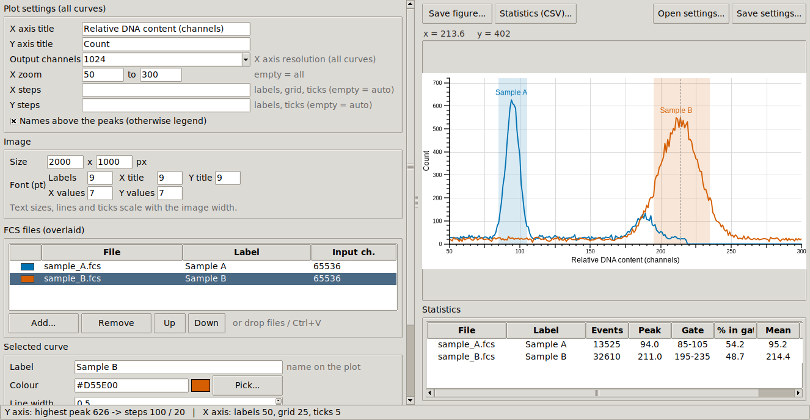
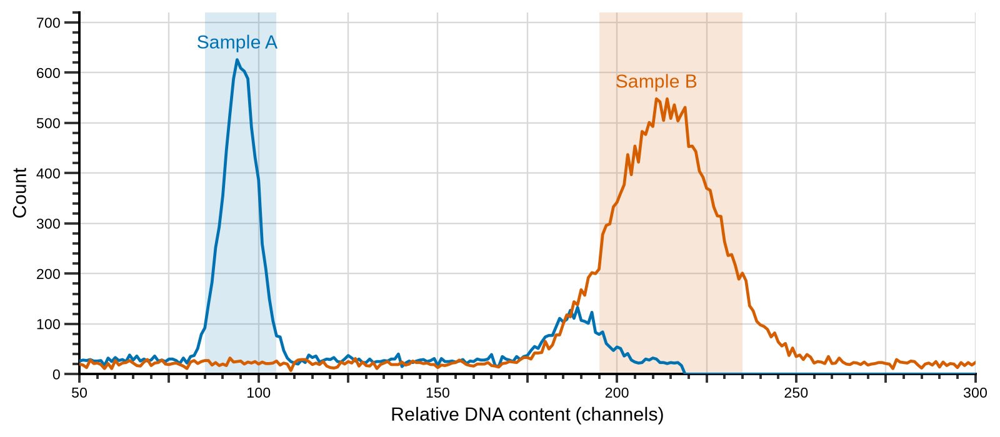

# CytoHisto

**Publication-ready flow cytometry histograms, from raw `.fcs` files to a figure in a few clicks.**

CytoHisto overlays one or more FCS files on a single-parameter histogram (typically DNA
content / ploidy) and exports a clean, journal-ready figure (PNG, TIFF, PDF, SVG) together
with the peak statistics. It comes as a standalone desktop application (Windows, Linux) and
as an R command-line script that produces the same figures.

Version **1.3.2** - see [CHANGELOG.md](CHANGELOG.md).



---

## Why CytoHisto?

CytoHisto was written because the usual routes to a publication figure were either blocked
or slow: an R pipeline that could not even read the instrument files, and viewers that
show the data but are not designed to produce a final figure. What it does differently:

### 1. It reads FCS files that other tools reject
Some instruments (e.g. Sysmex CyFlow Cube 6) store parameters with **different bit widths**
in the same file (16-bit fluorescence, 32-bit time). Bioconductor's `flowCore`, the reference
R reader, stops on these files with `object 'dat' not found`. CytoHisto ships its own FCS
2.0 / 3.0 / 3.1 reader that handles mixed bit widths, any byte order, and integer or
floating-point data - with no dependency on flowCore.

### 2. Files from different instruments on the same scale
Each file is converted with **its own input range** (read from its `$PnR` keyword) to a
common number of **output channels** (e.g. 1024, the convention for DNA content). A 10-bit
file (0-1023) and a 16-bit file (0-65535) are therefore overlaid correctly, without any
manual rescaling. The input range can still be overridden per file if an instrument
declares a wrong value.

The histogram itself always has **1024 classes over the full scale**: the output channels
only change the X axis unit. Switching from 1024 to 65536 channels changes neither the Y
axis nor the shape of the curves, and zoom, steps and gates follow automatically.

### 3. A final figure, not a screenshot
- **Image size in pixels**; text, lines and ticks **scale with the image width**, so a
  figure looks the same at 1000 or 4000 px wide.
- **Five independent text sizes**: labels, X title, Y title, X values, Y values.
- **Automatic round axis steps** (labels, grid, major and minor ticks), recomputed when you
  zoom; manual steps are accepted, and steps that would draw thousands of ticks are ignored
  instead of freezing the program.
- **Curve names placed above their peaks automatically** (the highest visible peak,
  ignoring debris near zero and the saturation channel), or a legend.
- Gates drawn as **highlighted regions** in the colour of their curve.
- Colour-blind-safe default palette; any HTML/CSS colour accepted (`#D55E00`, `#d50`,
  `rgb(213,94,0)`, `crimson`...).



### 4. The statistics you need for ploidy and DNA content
For every file: number of events, **peak channel**, and for the gated region the
**% of events, mean and CV** - the usual quality criterion of DNA-content histograms.
The table is exported to CSV in one click, and peak positions can be compared directly
(e.g. sample peak / internal standard peak).

### 5. What you see is what you save
The preview is rendered at the **exact proportions** of the exported image and refreshes
while you type. A cursor line shows the x / y coordinates under the mouse.

### 6. Free, offline, nothing to install
- A **single executable** (Windows `.exe` or Linux program): no Python, no R, no licence
  server, no account, no internet connection, no data leaving the computer.
- Files are added by **drag and drop**, **Ctrl+V** (files copied in the file manager) or the
  *Add...* button.
- All settings (files, colours, gates, axes, sizes, selection) are saved to a small **JSON**
  file, so a figure can be regenerated identically later - even after moving the project
  folder: files are found relative to the settings file, or searched for in a folder.
- The **R command-line version** produces the same figures from a script, for batch
  processing and reproducible pipelines.

---

## Download

| System | Program |
|---|---|
| Windows 10/11 (64-bit) | [`CytoHisto-1.3.2-windows-x86_64.exe`](https://github.com/ntzv-git/cytohisto/raw/main/bin/windows/CytoHisto-1.3.2-windows-x86_64.exe) |
| Linux x86-64 (built on Ubuntu 24.04) | [`CytoHisto-1.3.2-linux-x86_64`](https://github.com/ntzv-git/cytohisto/raw/main/bin/linux/CytoHisto-1.3.2-linux-x86_64) |

Click a link to download the program. It runs on its own: nothing else needs to be installed.

- **Windows**: double-click `CytoHisto-1.3.2-windows-x86_64.exe`. The program is not signed,
  so SmartScreen may show "Windows protected your PC": click *More info* then *Run anyway*.
  It takes a few seconds to start (the program unpacks itself).
- **Linux**: make the file executable, then run it:
  ```bash
  chmod +x CytoHisto-1.3.2-linux-x86_64
  ./CytoHisto-1.3.2-linux-x86_64
  ```

---

## Using the application

1. **Plot settings** (all curves): axis titles, output channels (X axis unit), X zoom and
   Y zoom, axis steps (empty = automatic, e.g. `200,100,20` for X labels/grid/ticks), names above the
   peaks or legend.
2. **Image**: size in pixels (default 2000 x 1000) and the five text sizes.
3. **FCS files**: drop, paste or add `.fcs` files. **Only the selected files are plotted**
   (click, Ctrl+click, Shift+click, Ctrl+A): keep many samples loaded and compare any subset.
   The Y axis fits the highest visible peak of the selection, unless a Y zoom is set. The list
   shows each file's colour, label and input range.
4. **Selected curve**: the last file clicked; set its label, colour, line width and type, smoothing,
   gate, parameter and input channels.
5. **Save figure...** (PNG, TIFF, PDF, SVG), **Statistics (CSV)...**, **Save / Open settings...**
   The figure and the statistics use the selected files only; the settings keep every imported
   file and the selection. If files were moved or deleted, opening the settings finds them
   relative to the settings file or offers to search a folder, and skips the missing ones.

---

## R command-line version

Requires R and the `ggplot2` package. `Rscript cytohisto.R -h` lists every option.

```bash
Rscript cytohisto.R -L -X 50,250 -s 2 -o comparison.png -P 3000x1500 \
    -f sample_A.fcs -n "Sample A" -c "#0072B2" -g 85,105 \
    -f sample_B.fcs -n "Sample B" -c crimson -w 0.8 -g 195,235
```

Shared options include `-C` output channels, `-X` / `-Y` zoom, `-L` names above the peaks,
`-P` image size in pixels. File options (`-n` label, `-c` colour, `-w` line width, `-t` line type, `-s` smoothing,
`-g` gate, `-p` parameter, `-i` input channels) apply to the preceding `-f`; placed before
the first `-f`, they apply to every file. The statistics table is printed in the console.

---

## Running or building from source

```bash
pip install numpy matplotlib tkinterdnd2
python cytohisto.py            # python cytohisto.py --version
```
(on Linux, also install `python3-tk`).

Standalone builds use [PyInstaller](https://pyinstaller.org):

- **Windows**: double-click `build_windows_exe.bat` (Python from python.org), or in a clean
  conda environment:
  ```bat
  conda create -n cytohisto python=3.12 -y
  conda activate cytohisto
  pip install numpy matplotlib pillow tkinterdnd2 pyinstaller
  pyinstaller --noconfirm --clean --onefile --windowed --name CytoHisto --collect-all tkinterdnd2 cytohisto.py
  ```
  Do not build from a large `base` environment: PyInstaller would try to bundle every
  installed package (and fails when several Qt bindings are present).
- **Linux**: `./build_linux.sh` (uses the system Python, which renders the interface with
  anti-aliased fonts; requires `python3-tk` and `python3-venv`).

The result is written to `dist/`.

---

## Repository content

| Path | Content |
|---|---|
| `cytohisto.py` | graphical application |
| `cytohisto.R` | R command-line version |
| `build_windows_exe.bat`, `build_linux.sh` | standalone build scripts |
| `bin/` | ready-to-use programs |
| `docs/` | images used in this README |
| `CHANGELOG.md` | version history |

---

## License

[MIT](LICENSE) - Copyright (c) 2026 Emmanuel Clostres. Free to use, modify and redistribute,
including in other projects, provided the licence notice is kept.
